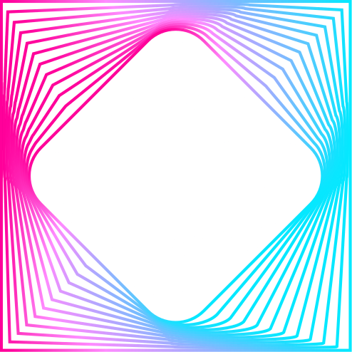

### Tesseract-Torch

Tesseract-Torch is a lightweight extension to [Tesseract Core](https://github.com/pasteurlabs/tesseract-core) that wraps Tesseracts as differentiable [PyTorch](https://pytorch.org/) operations, with full support for reverse-mode and forward-mode automatic differentiation.

[Read the docs](https://docs.pasteurlabs.ai/projects/tesseract-torch/latest/) |
[Explore the examples](https://github.com/pasteurlabs/tesseract-torch/tree/main/examples) |
[Report an issue](https://github.com/pasteurlabs/tesseract-torch/issues) |
[Talk to the community](https://si-tesseract.discourse.group/) |
[Contribute](CONTRIBUTING.md)

---

The API of Tesseract-Torch consists of a single function, [`apply_tesseract(tesseract, inputs)`](https://docs.pasteurlabs.ai/projects/tesseract-torch/latest/content/api.html#tesseract_torch.apply_tesseract), which integrates any Tesseract into PyTorch's autograd graph:

```python
result = apply_tesseract(my_tesseract, {"x": x_tensor})
result["y"].sum().backward()  # reverse-mode AD
x_tensor.grad  # gradients flow through the Tesseract
```

## Quick start

> [!NOTE]
> Before proceeding, make sure you have a [working installation of Docker](https://docs.docker.com/engine/install/) and a modern Python installation (Python 3.10+).

> [!IMPORTANT]
> For more detailed installation instructions, please refer to the [Tesseract Core documentation](https://docs.pasteurlabs.ai/projects/tesseract-core/latest/content/introduction/installation.html).

1. Install Tesseract-Torch:

   ```bash
   $ pip install tesseract-torch
   ```

2. Build an example Tesseract:

   ```bash
   $ git clone https://github.com/pasteurlabs/tesseract-torch
   $ tesseract build tesseract-torch/examples/simple/vectoradd_torch
   ```

3. Use it as part of a PyTorch program via `apply_tesseract`:

   ```python
   import torch
   from tesseract_core import Tesseract
   from tesseract_torch import apply_tesseract

   # Load the Tesseract
   t = Tesseract.from_image("vectoradd_torch")
   t.serve()

   # Run it with PyTorch tensors
   x = torch.ones(1000, requires_grad=True)
   y = torch.ones(1000)

   def vector_sum(x, y):
       res = apply_tesseract(t, {"a": {"v": x}, "b": {"v": y}})
       return res["vector_add"]["result"].sum()

   loss = vector_sum(x, y)
   loss.backward()
   print(x.grad)  # gradients via the Tesseract's VJP endpoint

   # Forward-mode AD is also supported via torch.autograd.forward_ad
   ```

> [!TIP]
> Now you're ready to jump into our [examples](https://github.com/pasteurlabs/tesseract-torch/tree/main/examples) for more ways to use Tesseract-Torch.

## Sharp edges

- **Required endpoints**: Using `apply_tesseract` with reverse-mode AD (`.backward()`, `torch.autograd.grad`) requires the Tesseract to define a [`vector_jacobian_product`](https://docs.pasteurlabs.ai/projects/tesseract-core/latest/content/api/endpoints.html#vector-jacobian-product) endpoint. Forward-mode AD (`torch.autograd.forward_ad`) requires [`jacobian_vector_product`](https://docs.pasteurlabs.ai/projects/tesseract-core/latest/content/api/endpoints.html#jacobian-vector-product).

## License

Tesseract-Torch is licensed under the [Apache License 2.0](LICENSE) and is free to use, modify, and distribute (under the terms of the license).

Tesseract is a registered trademark of Pasteur Labs, Inc. and may not be used without permission.
